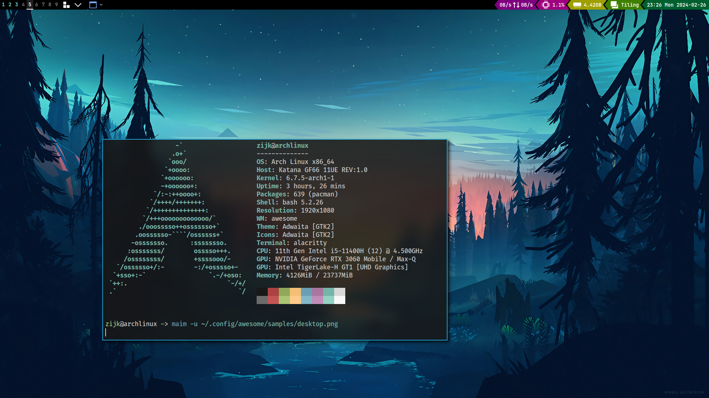

# Personal Awesome WM Lua Config

**This is a work in progress**

Dependencies:
- `brightnessctl`
- `dunst` (with custom script to get latest notifications from `dunstctl history`)
- `iwd` (with custom script written to get the wifi name)
- `pamixer`
- `rofi`

